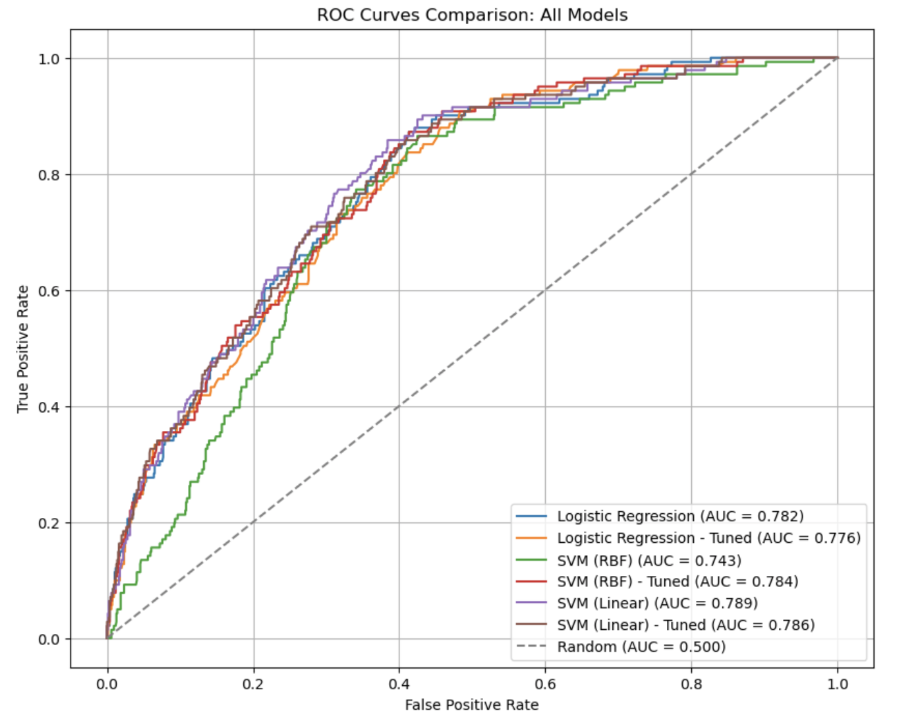

# Diabetes Prediction Using 2014 BRFSS Dataset

## Project Overview
This repository contains the code and documentation for a data science class project (ANA500) aimed at predicting diabetes occurrence using a sub-sample of the 2014 Behavioral Risk Factor Surveillance System (BRFSS) dataset. The goal is to preprocess the dataset, perform exploratory data analysis (EDA), and develop neural network and deep learning models to predict diabetes status. The target variable, `DIABETE3`, is recoded into a binary variable (`DIABETE3_binary`: 1 = Yes [diagnosed diabetes or pre-diabetes], 0 = No [gestational or no diabetes]) to simplify classification for neural network modeling in Modules 3/4. The project includes extensive data cleaning, imputation of missing values and non-response codes, and preparation for advanced modeling.

### Objectives
- **Data Preprocessing**: Clean the BRFSS dataset by handling missing values, non-response codes (e.g., 7, 9, 77, 99), and converting `WEIGHT2` from kilograms to pounds.
- **Exploratory Data Analysis (EDA)**: Analyze relationships between diabetes status (`DIABETE3_binary`) and predictors like `_BMI5CAT`, `WEIGHT2`, and `GENHLTH` using visualizations (e.g., bar plots, histograms).
- **Modeling**: Build neural network and deep learning models to predict diabetes occurrence, addressing class imbalance with class weights.
- **Evaluation**: Assess model performance using metrics such as accuracy, precision, recall, and AUC for binary classification.

## Dataset
The dataset is a subset of the 2014 BRFSS survey with 5,000 rows and 34 variables, all encoded as `int64` or `float64`. Key variables include:
- **Target**: `DIABETE3` (diabetes status, recoded to `DIABETE3_binary`: 1 = Yes [categories 1, 4], 0 = No [categories 2, 3]).
- **Predictors**: `_BMI5CAT` (BMI categories), `WEIGHT2` (weight in pounds), `GENHLTH` (general health), `INCOME2` (income level), and others.
- **Missing Values and Codes**: Variables have missing (`NaN`) values and non-response codes (e.g., 7, 9, 77, 99) indicating "Don't know" or "Refused," imputed using mode, median, or KNN methods.

### Data Preprocessing Steps
1. **WEIGHT2 Conversion**:
   - Converted weights from kilograms (9000–9998) to pounds using 1 kg ≈ 2.20462 lbs.
   - Kept pounds (50–999) unchanged.
   - Set invalid codes (7777, 9999) to `NaN` for imputation.
2. **Mode Imputation** (14 categorical/binary variables):
   - Variables: `EMPLOY1`, `MARITAL`, `_RACE`, `CHILDREN`, `CVDCRHD4`, `CHCKIDNY`, `_TOTINDA`, `ADDEPEV2`, `EXERANY2`, `HLTHPLN1`, `_STATE`, `ASTHMA3`, `DIABETE3`, `RENTHOM1`.
   - Set non-response codes (e.g., 7, 9, 66, 99) to `NaN` and imputed with mode.
3. **Median Imputation** (7 ordinal/count-like variables):
   - Variables: `INCOME2`, `GENHLTH`, `_AGEG5YR`, `_EDUCAG`, `CHECKUP1`, `SLEPTIM1`, `MENTHLTH`.
   - Set codes (e.g., 77, 99, 14) to `NaN` and imputed with median.
   - Recoded `MENTHLTH` 88 to 0 (no days) before imputation.
4. **KNN Imputation** (10 variables with high missing or correlations):
   - Variables: `MSCODE`, `HLTHCVR1`, `NUMADULT`, `DRVISITS`, `FLUSHOT6`, `DECIDE`, `BLIND`, `USEEQUIP`, `_BMI5CAT`, `WEIGHT2`.
   - Set codes (e.g., 7, 9, 77, 9999) to `NaN`, imputed using KNN (n_neighbors=5), and mapped categorical variables to valid values (e.g., 1, 2 for `DECIDE`).
   - `DRVISITS` recoded 88 to 0 before imputation.
5. **DIABETE3 Recoding**:
   - Pre-imputation distribution: 1 (627), 2 (39), 3 (4251), 4 (76), 7 (2), 9 (5).
   - Post-mode imputation: 1 (627), 2 (39), 3 (4258), 4 (76).
   - Recoded to `DIABETE3_binary`: 1 and 4 = Yes (703), 2 and 3 = No (4297).
   - Original `DIABETE3` retained for EDA.
6. **Correlation Analysis**:
   - `EXERANY2` and `_TOTINDA` had a correlation of 1, eliminated `_TOTINDA` and will use `EXERANY2`.  Both were binary yes/no categorical variables.
   - `WEIGHT2_capped` and `_BMI5CAT` had a correlation of 0.77, eliminated `WEIGHT2_capped` and will use `_BMI5CAT`. `_BMI5CAT` is a categorical variable with 4 easily understood           categories, (underweight, normal, overweight and obese).
7. **Additional Recoding**:
   - `INCOME2` was recoded from 8 narrow unbalanced categories to 5 broader and better balanced categories (`INCOME_recoded`: 1=<20k, 2=20-35k, 3=35-50k, 4=50-75k, 5=>75k).
   - `_AGEG5YR` was recoded from 13 five-year categories to 4 categories (`AGE_recoded`: 1=18-34, 2=35-49, 3=50-65, 4=65-99).
   - `_BMI5CAT` was recoded from 4 categories to three categories by combining underweight and normal into one category resulting in (`BMI_recoded`: 1=Normal, 2=Overwight, 3=Obese).
   - `DRVISITS_capped` had several floating point numbers that resulted in over 40 categories, so they were recoded into integers resulting in 12 categories, with 12 being the capped       variable from the outlier capping previously performed (`DRVISITS_recoded`).
   - `EMPLOY1` was recoded from 8 to 4 categories. ‘Employed for wages’ and ‘Self-employed’ were combined into ‘Working.’ ‘Retired’ remained its own category. ‘Homemaker’ and               ‘student’ were combined, and ‘out of work >= to 1 year,’ ‘out of work < 1 year’ and ‘unable to work’ were combined, resulting in (`EMPLOY_recoded`: 1=Working, 2=Retired,              3=Homemaker/Student, 4=Out of/unable to work).
   - `MENTHLTH`, which represented the number of days the respondent reported their mental health being “not good” over the last 30 days, which resulted in 27 categories, was recoded       into four categories (`MNTLHLTH_recoded`: 0 = 0 days, 1 = 1-5 days, 2 = 6-15 days, 3 = 16-30 days).

## Feature selection process

To determine the most relevant variables for predicting diabetes, we explored several statistical methods and blended the results with domain expertise.

### Methods
*   **Principal Component Analysis (PCA):** Analyzed feature loadings on the first five principal components, which collectively captured approximately 32.2% of the total variance. The analysis identified important variables related to health (`GENHLTH`, `MENTHLTH_recode`), demographics (`AGE_recoded`), and socioeconomic status (`INCOME_recoded`).
*   **Recursive Feature Elimination (RFE):** A backward elimination method selected an optimal subset of 15 features based on a model's performance, achieving an accuracy of 0.713.
*   **Forward Selection:** A forward-building method using F1-scores was implemented to iteratively add the best-performing features. Analysis showed diminishing returns after the first 10 features, with a final F1-score of 0.435 and accuracy of 0.738.

### Final selection
Based on a combined assessment of the statistical results and domain knowledge, a final set of 12 features was selected to build the predictive model. These include:
*   **Health:** `GENHLTH`, `BMI_recoded`, `CVDCRHD4`, `CHCKIDNY`, `DRVISITS_recoded`, `EXERANY2`, `MENTHLTH_recode`
*   **Demographic:** `AGE_recoded`
*   **Socioeconomic:** `INCOME_recoded`, `_EDUCAG`, `EMPLOY_recoded`
*   **Other:** `DECIDE`

# Final Preparation for Modeling

To prepare the dataset for modeling, the following steps were performed to ensure the data is in a suitable format and addresses the class imbalance in `DIABETE3_binary` (~14% Yes, ~86% No):

- **One-Hot Encoding of Categorical Variables**: Applied one-hot encoding to all 12 selected features (`GENHLTH`, `BMI_recoded`, `AGE_recoded`, `INCOME_recoded`, `_EDUCAG`, `MENTHLTH_recode`, `EMPLOY_recoded`, `CVDCRHD4`, `CHCKIDNY`, `DRVISITS_recoded`, `EXERANY2`, `DECIDE`) to convert categorical variables into binary columns. This avoids assuming ordinal relationships and ensures compatibility with neural network inputs. The `OneHotEncoder` from scikit-learn was used, dropping the first category to prevent multicollinearity.
- **Class Weights for Imbalanced Data**: Computed class weights to address the ~6:1 imbalance in `DIABETE3_binary` (class 0: ~4297, class 1: ~703). Assigned weights `{0: 1.0, 1: ~6.11}` to penalize misclassifications of the minority class (diabetes positive) more heavily during training, improving performance on the Yes class.
- **Train-Test Split**: Performed an 80/20 train-test split with stratification to maintain the ~14% Yes proportion in both sets. Used `random_state=42` for reproducibility.
- **Feature Scaling**: Applied `StandardScaler` to the one-hot encoded features *after* the train-test split to standardize the data (mean=0, std=1), ensuring stable neural network training. The scaler was saved as a pickle file in `data/processed/scaler.pkl` for future use.
- **Custom Python Functions**: Developed a set of Python functions to streamline training, evaluation, and visualization of binary classification models. These functions automate:
  - Training models with specified hyperparameters.
  - Calculating key performance metrics (accuracy, precision, recall, F1-score, ROC-AUC).
  - Generating visualizations, including confusion matrices, ROC curves, and Precision-Recall (PR) curves, to compare model performance effectively.

## Model Evaluation Metrics

Given the imbalanced dataset (~6:1 ratio of No to Yes in `DIABETE3_binary`), the following metrics are prioritized for evaluating model performance, with a focus on the minority class (diabetes positive):

- **Recall**: Measures the proportion of actual positive cases (diabetes) correctly identified, calculated as TP / (TP + FN). High recall is critical for medical applications like diabetes detection to minimize false negatives (missing positive cases), which could have serious health implications.
- **F1-Score**: The harmonic mean of precision and recall, calculated as \(2 \times \frac{\text{precision} \times \text{recall}}{\text{precision} + \text{recall}}\). This metric balances precision and recall, making it suitable for imbalanced datasets where accuracy can be misleading due to the dominance of the negative class.
- **ROC-AUC**: Area under the Receiver Operating Characteristic curve, quantifying the model’s ability to distinguish between classes across all classification thresholds. A higher ROC-AUC indicates better overall performance, particularly important for imbalanced data to ensure good class separation.

**Evaluation Strategy**: Models will be sorted by F1-score and ROC-AUC to prioritize those that balance precision and recall while maintaining strong class discrimination. This ensures robust performance on the minority class (diabetes positive), aligning with the project’s goal of accurate diabetes prediction.

## Baseline Model Training and Evaluation

To establish a performance baseline for the diabetes prediction project using the 2014 BRFSS dataset, logistic regression and Support Vector Machine (SVM) models with Radial Basis Function (RBF) and Linear kernels were trained and evaluated on the preprocessed dataset (12 one-hot encoded and scaled features, 80/20 train-test split with stratification, class weights `{0: 1.0, 1: ~6.11}` to address the ~6:1 imbalance in `DIABETE3_binary`). Hyperparameter tuning and cross-validation were performed to optimize models, followed by feature coefficient analysis and feature reduction experiments to refine the feature set for the upcoming deep learning module (Micro Project 4).

### Logistic Regression
- **Model**: Trained a basic logistic regression model on the encoded and scaled dataset.
- **Hyperparameter Tuning**: Used GridSearchCV to tune the following parameters:
  - `C`: [0.01, 0.1, 1, 10, 100]
  - `penalty`: ['l1', 'l2']
  - `solver`: ['liblinear', 'saga']
- **Performance** (untuned):
  - **Accuracy**: 0.720 (high, likely due to majority class dominance)
  - **ROC-AUC**: 0.7820 (solid class separation)
  - **F1-Score**: 0.3991 (decent for imbalanced data)
  - **Recall**: 0.6596 (good, but lower than SVM Linear)
  - **Precision**: 0.2862 (comparable to SVM Linear)
- **Strengths**: High accuracy and good ROC-AUC, indicating effective class separation. Decent F1-score and recall for the minority class (diabetes positive).
- **Weaknesses**: Lower recall than SVM (Linear), missing more positive cases. Precision similar to SVM (Linear), with comparable false positives.
- **Tuning Impact**: Hyperparameter tuning reduced F1-score and recall compared to the untuned model, suggesting the default parameters were better suited for this dataset. The untuned model is preferred.

### Support Vector Machine (RBF Kernel)
- **Model**: Trained an SVM model with RBF kernel on the encoded and scaled dataset.
- **Hyperparameter Tuning**: Used GridSearchCV to tune:
  - `C`: [0.1, 1, 10]
  - `gamma`: ['scale', 'auto', 0.001, 0.01, 0.1]
- **Performance** (tuned, C=1, gamma=0.001):
  - **Accuracy**: 0.735 (highest, but skewed by majority class)
  - **ROC-AUC**: 0.7434 (lowest among models)
  - **F1-Score**: 0.3552 (lowest)
  - **Recall**: 0.5177 (lowest, missing many positive cases)
  - **Precision**: 0.2704 (lowest, more false positives)
- **Strengths**: Highest accuracy, though biased toward the majority class. Tuning improved performance over the untuned model.
- **Weaknesses**: Lowest recall and F1-score, indicating poor performance on the minority class (diabetes positive). Lowest ROC-AUC, suggesting weaker class separation.
- **Tuning Impact**: Tuning (C=1, gamma=0.001) significantly improved F1-score and recall over the untuned SVM (RBF), showing the RBF kernel benefits from a smaller gamma for this dataset.

### Support Vector Machine (Linear Kernel)
- **Model**: Trained an SVM model with Linear kernel on the encoded and scaled dataset.
- **Hyperparameter Tuning**: Used GridSearchCV to tune:
  - `C`: [0.01, 0.1, 1]
- **Performance** (tuned, C=0.01):
  - **Accuracy**: 0.712 (slightly lower, less critical due to imbalance)
  - **ROC-AUC**: 0.7858 (near-highest, excellent class separation)
  - **F1-Score**: 0.4125 (highest among models)
  - **Recall**: 0.7021 (highest, capturing most positive cases)
  - **Precision**: 0.2870 (comparable to logistic regression)
- **Strengths**: Highest recall and F1-score, ideal for medical screening to minimize missed diabetes cases. Near-highest ROC-AUC, indicating excellent class separation.
- **Weaknesses**: Slightly lower F1-score than untuned version and similar precision to logistic regression, indicating comparable false positives. Lower accuracy than tuned version, but accuracy is less critical for imbalanced data.
- **Tuning Impact**: Tuning with stronger regularization (C=0.01) improved F1-score over the untuned model, suggesting a simpler model avoids overfitting on the imbalanced dataset.

### Cross-Validation
- Performed cross-validation for all models (logistic regression, SVM RBF, SVM Linear) to provide a more robust estimate of generalization performance compared to a single train-test split. Cross-validation results informed the selection of the best model by ensuring stable metric estimates.

### Consolidated Results

**Visualization**: Consolidated results table for all models (Logistic Regression, SVM RBF, SVM Linear, tuned and untuned) was prepared to compare overall performance, with SVM (Linear, Tuned) showing near-best performance:
  

- **Best Model**: **SVM (Linear, Tuned, C=0.01)**
  - **Metrics**: Highest F1-score (0.4125), strong recall (0.7021), and near-highest ROC-AUC (0.7858).
  - **Rationale**: Excels at capturing most positive cases (high recall), critical for medical screening to minimize missed diabetes diagnoses. Balances precision and recall (high F1-score) and maintains excellent class separation (high ROC-AUC). Outperforms untuned SVM (Linear) in F1-score and accuracy, showing tuning optimized performance for the imbalanced dataset.
- **Visualization**: Consolidated ROC curves for all models were plotted to compare class separation performance, with SVM (Linear, Tuned) showing near-best performance.

### Feature Coefficient Analysis (SVM Linear, Tuned)
- Examined feature coefficients for the best model (SVM Linear, Tuned) to assess feature importance:

**Visualization**: Feature Coefficients for SVM Linear - Tuned:

### Feature Reduction Experiments

To optimize the feature set for the deep learning module (Micro Project 4), two feature reduction experiments were conducted using the coefficients from the best baseline model (SVM Linear, Tuned with C=0.01). Features with low absolute coefficients were removed to assess their impact on model performance for predicting `DIABETE3_binary`.

- **Aggressive Reduction**:
  - **Reduced Feature Set**: Eliminated features with absolute coefficients <0.05 in SVM (Linear, Tuned):
    - Features: `AGE_recoded_4.0`, `AGE_recoded_3.0`, `AGE_recoded_2.0`, `GENHLTH_recoded_3.0`, `GENHLTH_recoded_2.0`, `BMI_recoded_3`, `BMI_recoded_2`, `EMPLOY_recoded_2.0`, `EMPLOY_recoded_4.0`, `EMPLOY_recoded_3.0`, `CVDCRHD4_2.0`, `CHCKIDNY_2.0`
  - **Experiment**: Re-ran SVM (Linear, Tuned) with the reduced feature set.
  - **Performance Comparison**:
    - **F1-Score**: Original = 0.4125, Reduced = 0.4066, Change = -0.0059
    - **Recall**: Original = 0.7021, Reduced = 0.6950, Change = -0.0071
    - **ROC-AUC**: Original = 0.7858, Reduced = 0.7845, Change = -0.0012
  - **Conclusion**: The slight performance drop suggests that the removed features (e.g., `MENTHLTH_recode`, `DECIDE`) contributed marginally useful information for predicting `DIABETE3_binary`, indicating their value in the model.

- **Less Aggressive Reduction**:
  - **Reduced Feature Set**: Eliminated features with absolute coefficients <0.01 in SVM (Linear, Tuned):
    - Features: `AGE_recoded_4.0`, `AGE_recoded_3.0`, `AGE_recoded_2.0`, `GENHLTH_recoded_3.0`, `GENHLTH_recoded_2.0`, `BMI_recoded_3`, `BMI_recoded_2`, `EMPLOY_recoded_2.0`, `EMPLOY_recoded_4.0`, `EMPLOY_recoded_3.0`, `CVDCRHD4_2.0`, `_EDUCAG_4.0`, `CHCKIDNY_2.0`, `INCOME_recoded_2.0`, `DRVISITS_recoded_2_4`, `INCOME_recoded_5.0`, `DRVISITS_recoded_2_2`, `MENTHLTH_recode_1`
  - **Experiment**: Re-ran SVM (Linear, Tuned) with this less aggressive reduced feature set.
  - **Performance Comparison**: Observed an across-the-board performance drop (specific metrics not provided), indicating that even features with low coefficients (<0.01) contributed useful information for predicting `DIABETE3_binary`.
  - **Conclusion**: The performance degradation reinforces that all selected features provide valuable predictive information.

- **Final Decision**: Retained the original 12-feature set (post-one-hot encoding: `GENHLTH`, `BMI_recoded`, `AGE_recoded`, `INCOME_recoded`, `_EDUCAG`, `MENTHLTH_recode`, `EMPLOY_recoded`, `CVDCRHD4`, `CHCKIDNY`, `DRVISITS_recoded`, `EXERANY2`, `DECIDE`) for Micro Project 4, as both feature reduction experiments led to performance drops, suggesting all features are important for optimal model performance.

## Deep Learning Modeling Overview
- Implemented **Multi-Layer Perceptron (MLP)** models using Keras/TensorFlow for binary classification of diabetes (`DIABETE3_binary`), starting with a basic architecture and iteratively adding dropout, early stopping, L2 regularization, batch normalization, adjusted learning rates, and class weights to address overfitting and class imbalance.
- Trained all models on scaled one-hot encoded features with 50–100 epochs and batch sizes of 32–64, using binary cross-entropy loss and Adam optimizer.

## MLP Model Evolution
- **Model 1: Basic MLP** – Baseline with 3 layers (64 → 32 → 1), no regularization; achieved F1 = 0.322, ROC-AUC = 0.711; served as a starting point but showed overfitting.
- **Model 2: Advanced MLP** – Increased complexity (128 → 64 → 32 → 1), added dropout (0.3) and early stopping (patience=10); best MLP F1 = 0.410, ROC-AUC = 0.758.
- **Model 2A: Improved Advanced MLP** – Simplified to 3 layers (64 → 32 → 16), added L2 regularization, dropout 0.4, lower learning rate (0.0001); F1 = 0.390, ROC-AUC = 0.765.
- **Model 2B: Further Improved MLP** – Further reduced to 3 layers (32 → 16 → 8), added batch normalization, dropout 0.5, class weight 7.0; highest recall = 0.773, ROC-AUC = 0.768.

## NAM Model Implementation (DNAMite)
- Used **Neural Additive Models (NAM)** via `dnamite` to improve interpretability over black-box MLPs; trained on top 3, 5, 10, and full (~27) features selected from SVM coefficients.
- Applied **threshold tuning** using precision-recall curves to match SVM recall (~0.702), enabling direct F1 comparison.
- **Top-10 NAM (tuned)** achieved F1 = 0.400, ROC-AUC = 0.778 — best balance of performance and interpretability.

## NAM Interpretability
- NAMs decompose predictions into **additive feature contributions**, with each feature modeled by an independent subnetwork.
- Enables **clear visualizations**:
  - **Feature Importance Bar Chart**: Shows relative contribution of each feature.
  
  - **Partial Dependence Plots**: Displays how predicted diabetes risk changes with each feature (e.g., non-linear BMI effect).
   
- Far more interpretable than MLPs or standard deep models — ideal for clinical decision support.

## Final Top 3 Model Comparison

| Model                          | Accuracy | Precision | Recall | F1     | ROC-AUC |
|--------------------------------|----------|-----------|--------|--------|---------|
| **SVM (Linear) - Tuned**       | **0.7180** | 0.2920    | **0.7021** | **0.4125** | **0.7858** |
| DNAMite NAM (Top-10, Tuned)    | 0.7030   | 0.2797    | 0.7021 | 0.4000 | 0.7779  |
| Advanced MLP                   | 0.7350   | **0.2987** | 0.6525 | 0.4098 | 0.7577  |

- **Winner**: **SVM (Linear)** — best F1, recall, and ROC-AUC; stable and efficient.
- **Runner-Up**: **NAM (Top-10, Tuned)** — near-SVM performance with **full interpretability**.
- **MLP**: Strong but **underperformed** due to small dataset and overfitting risk.

---

### Notes
- SVM excels on **small, tabular, imbalanced datasets** with linear or near-linear patterns.
- NAM is **ideal when interpretability is critical** (e.g., healthcare).
- Deep learning (MLP/NAM) may outperform on **larger, more complex datasets** with non-linear interactions.
